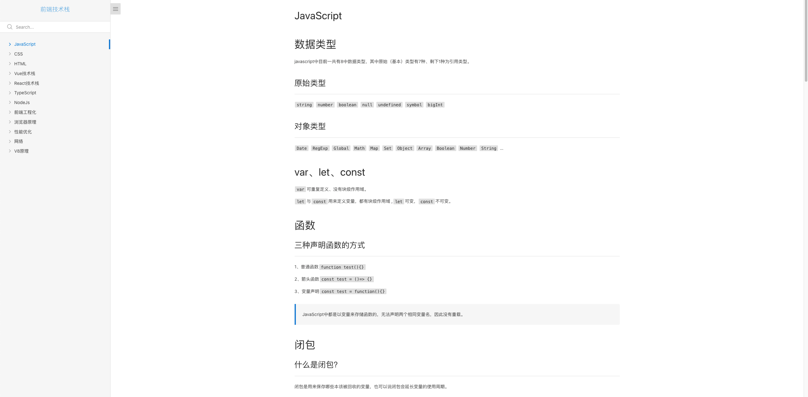

# 前端基础总结

其中包括`js` `css` `html` 基础，`react` `vue` `redux` `mobx` 等原理总结，`网络` `v8` `前端工程化` `typescript` `性能优化`等

  <link href="http://duobaoaide.com/">
   
  </link>

 

> 🚀  持续更新中

## Reference

https://docsify.js.org/#/zh-cn/quickstart
