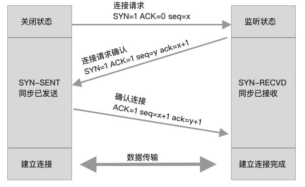
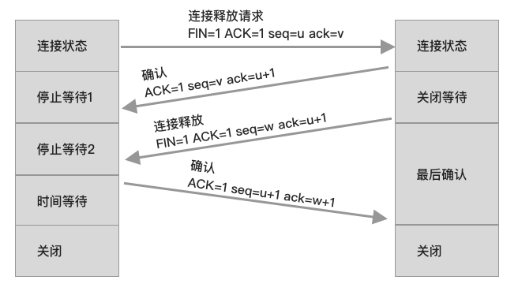
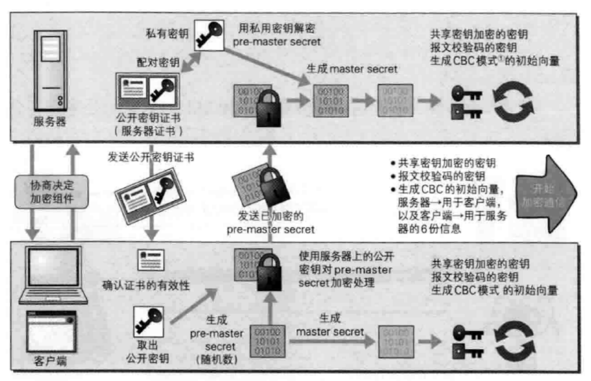

# 网络协议

## 网络分层模型

**OSI 模型**

OSI制定的标准将网络模型分为7层 

物理层、数据链路层、网络层、运输层、会话层、表示层、应用层

**TCP/IP协议分层模型**

* `数据链路层`与`物理层`合并成`网络接口层`。
* `应用层`、`表示层`、`会话层`合并成`应用层`。

一共分为4层，分别是网络接口层、网际层、运输层、应用层。

**用于学习研究的模型**

用于学习研究将网络模型分为5层，分别是物理层、数据链路层、网络层、运输层、应用层。

## 网络请求的过程

当客户端发起网络请求时会从最上面的应用层到达物理层来发送数据。

服务端接收到数据时会从物理层到应用层解析数据。

> OSI:Open System Interconnect Reference Model

## 应用于模型层的网络协议

| 模型层     | 协议                   | 数据类型       |
| :--------- | :--------------------- | :------------- |
| 应用层     | FTP,HTTP,SMTP,DNS,DHCP | 报文，用户数据 |
| 运输层     | TCP,UDP                | 段             |
| 网络层     | IP                     | 包             |
| 数据链路层 | MAC                    | 帧             |
| 物理层     |                        | 比特流         |

## 网络连接的硬件

| 网络硬件 | 作用                                                         |
| -------- | ------------------------------------------------------------ |
| 同轴电缆 | 半双工通讯、容易冲突、不安全、中间断了整个瘫痪               |
| 集线器   | 半双工通讯、容易冲突、不安全                                 |
| 网桥     | 能够记住接口那侧的Mac地址、隔绝冲突域                        |
| 交换机   | 相对于接口更多的网桥、全双工、比集线器安全                   |
| 路由器   | 网线直连、同轴电缆、集线器、网桥、交换机连接的设备必须在同一网段、和同一广播域；  路由器可以在不同的网段之间转发数据、隔绝广播域 |

## Mac地址

网卡的唯一标识

**ARP协议**

通过IP获取MAC地址的解析协议。

**RARP协议**

将MAC地址转换成IP地址的协议

后来被`bootp`,`DHCP`取代。

## IP地址

**IPV4**

IPV4由32位组成（4个字节）

### IP地址的组成

IP地址由两部分组成：网络标识（网络ID）,主机标识（主机ID）

> 位就是一个二进制数
>
> 1字节=8位

### IP地址分类

| IP地址类型 | 描述                                                  | 默认子网掩码  |
| ---------- | ----------------------------------------------------- | ------------- |
| A类        | 0开头，网络ID占8位，主机ID占24位（16777214）          | 225.0.0.0     |
| B类        | 10开头，网络ID占16位，主机ID占16位（最多65534个主机） | 225.225.0.0   |
| C类        | 110开头，网络ID占24位，主机ID占8位（最多254个主机）   | 225.225.255.0 |
| D类        | 1110开头，                                            |               |
| E类        | 1111开头，                                            |               |

### 网段

主机所在的网段 = 子网掩码 & IP地址

不同网段之间通讯需要用路由器转发。

## 子网掩码

用来划分子网

## 物理层

物理层定义了接口标准、线缆标准、传输速率、传输方式等。

### 数字信号、模拟信号

* 模拟信号属于连续的信号、适合长距离传输、容易受干扰。
* 数字信号属于离散的信号，不适合长距离传输，抗干扰强。

> 广域网的通讯：就是使用调制解调器（光猫），将数字信号于模拟信号互转实现长距离通讯。

### 信道

信息传输的通道，一条传输介质（网线）上可以有多条信道。

**单工通讯**

* 信号只能往一个方向传输，任何时候都不能改变信号的传输方向。
* 比如无线电广播、有线电视广播。

**半双工通讯**

* 信号可以双向传输，但必须交替进行，同一时间只能往一个方向传输
* 比如对讲机

**全双工通讯**

* 信号可以同时双向传输
* 比如手机（打电话，听说可以同时进行）

## 数据链路层

### 链路

从一个节点到相邻节点的一段物理线路（有线或无线）。从一个节点到另一个节点怎么走。

### 数据链路

在一条链路上传输数据时需要由对应的通讯协议来控制数据的传输。

**不同类型的数据链路对应的通讯协议**

广播信道：CSMA/CD协议（比如同轴电缆、集线器组成的网络）

点对点信道：PPP协议（两个路由器之间的信道）

### 数据链路的三个基本问题

* 封装成帧
* 透明传输
* 差错检验

## 网络层

网络层数据包(IP数据包、Packet)：由首部、数据两部分组成。

> 数据：由传输层传递下来的数据段

## 传输层

运输层协议为提供了网络之间的逻辑通讯。将报文报文整理成段，传递给网络层。

运输层主要的作用是将报文段交付给主机上适当的进程。

### 多路分解 多路复用

**多路分解**

传输层接收到数据后并不是直接将数据交付给进程，而是将数据先给到套字节，正确的将数据给到套字节的过程叫**多路分解**。

**多路复用**

发送数据时主机从不同的套字节中收集数据，并处理传递给网络层的过程叫**多路复用**。

### 传输层协议（TCP、UDP）

传输层有两个协议分别是`TCP`和`UDP`

|              | TCP                        | UDP                                  |
| ------------ | -------------------------- | ------------------------------------ |
| 连接性       | 面向连接                   | 无连接                               |
| 可靠性       | 可靠传输、不丢包           | 不可靠传输、尽最大努力交付、可能丢包 |
| 首部占用空间 | 大                         | 小                                   |
| 传输速率     | 慢                         | 快                                   |
| 资源消耗     | 大                         | 小                                   |
| 应用场景     | 浏览器、文件传输、邮件发送 | 音视频通话、直播                     |
| 应用层协议   | HTTP,HTTPS,FTP,SMTP,DNS    | DNS                                  |

### UDP协议

#### 数据格式

首部只有8个字节，由目标端口号、源端口号、UDP长度（首部的长度+数据长度）、校验和组成。

#### 校验和

用于校验数据的完整性和准确性。

校验和的计算内容：伪首部+首部+数据。

伪首部仅在计算校验和起作用，不会传递给网络层。

### TCP协议

#### 数据格式

TCP协议为了保证数据的可靠传输、完整。首部也比UDP长，有20个字节的固定首部。

#### 校验和

计算内容：伪首部 + 首部 + 数据

占12个字节，不会传递给网络层

#### 标志位

* URG=1时，紧急指针生效，表示当前报文中有紧急数据，优先尽快传输。
* ACK =1时，确认号字段才会生效。
* PSH (push)
* RST (Reset) = 1时 ，表示连接中出现严重差错，必须释放连接，然后重新连接。
* SYN , 当syn=1时、ack=0，表示这是一个建立连接的请求。如果对方同意连接，则回复syn=1、ack=1。
* FIN , 当FIN = 1时，表明数据已经发送完毕，要求释放连接。

#### 序号

* 占4字节
* 传输过程中每一个字节都有一个编号，序号表示传递给对方数据部分的，第一个字节的编号。

#### 确认号

* 占4字节
* 表示期望对方下一次传过来的TCP数据部分的第一个字节的编号

#### TCP的特点

#### 可靠传输

##### 停止等待ARQ协议

如果发生数据包丢失，则超时重传。

如果在B发送确认数据时发生了丢失数据，A会重新发送。过了一会儿B的M1数据确认再到达A，则A什么也不做。

> 如果重传5次还没有成功，就会使RST=1,然后断开连接。

#### 连续ARQ协议 + 滑动窗口

由于停止等待协议每一次A都要发送然后等待B确认，这个过程效率太低。使用连续ARQ协议连续发送多个分组数据。然后再等待B确认。

**滑动窗口**

发送方与接收方，使用滑动滑动窗口来缓存数据。

发送方将一组数据发送给接收方，接收方接收到数据后缓存起来，然后再滑动窗口接收下一次的数据。

> 批量发送数据可能会导致数据某个包丢失
>
> SACK技术会告知发送方接收到的数据和丢失的数据，这样发送方只需要重新发送丢失的包。而不用重发相同的数据

#### 流量控制

让发送方发送的速率不要太快，不然接收方来不及接收。

* 通过确认保存中窗口字段来控制发送方的发送速率。
* 发送方的发送窗口大小不能超过接收方给出的窗口大小。
* 当发送方收到的接收窗口大小为0时，发送方就会停止发送数据。

#### 拥塞控制

拥塞控制需要所有的主机，路由器协作完成。避免带宽造成拥挤，导致数据包丢失。

解决拥塞控制采用下面几种策略：

* 慢开始

  一开始cwnd的值很小，在数据传输过程中。拥塞窗口成指数级增长。

* 拥塞避免

  cwnd达到阈值，则线性增加。

  只要网络出现拥塞(cwnd恢复到初始值)

* 快速重传

  接收方只要收到失序的分组，则发送重复确认。接收方如果连续收到3次重复确认就立即重传。

* 快速恢复

  快速恢复就是将拥塞降到一定阈值后，然后加法增大。（而不是回到慢开始重新来）

> MSS : 每个段最大数据部分大小
>
> cwnd : 拥塞窗口
>
> rwnd : 接收窗口
>
> swnd : 发送窗口

#### 三次握手

**第一次握手**

客户端向服务端发送连接请求报文段。该报文段中包含自身的数据通讯初始序号。请求发送后，客户端便进入 SYN-SENT 状态。

**第二次握手**

服务端收到连接请求报文段后，如果同意连接，则会发送一个应答，该应答中也会包含自身的数据通讯初始序号，发送完成后便进入 SYN-RECEIVED 状态。

**第三次握手**

当客户端收到连接同意的应答后，还要向服务端发送一个确认报文。客户端发完这个报文段后便进入 ESTABLISHED 状态，服务端收到这个应答后也进入 ESTABLISHED 状态，此时连接建立成功。

> 为什么 TCP 建立连接需要三次握手，明明两次就可以建立起连接
>
> 客户端第一次发送因为网络超时，然后再发一次。服务端收到了第二次的请求进行响应，结果客户端第一次又到达了服务端，服务端以为客户端又要握手，于是有进行响应。三次握手可以解决不必要的资源浪费

#### 四次挥手

**第一次握手**

若客户端 A 认为数据发送完成，则它需要向服务端 B 发送连接释放请求。

**第二次握手**

B 收到连接释放请求后，会告诉应用层要释放 TCP 链接。然后会发送 ACK 包，并进入 CLOSE_WAIT 状态，此时表明 A 到 B 的连接已经释放，不再接收 A 发的数据了。但是因为 TCP 连接是双向的，所以 B 仍旧可以发送数据给 A。

**第三次握手**

B 如果此时还有没发完的数据会继续发送，完毕后会向 A 发送连接释放请求，然后 B 便进入 LAST-ACK 状态。

PS：通过延迟确认的技术（通常有时间限制，否则对方会误认为需要重传），可以将第二次和第三次握手合并，延迟 ACK 包的发送。

**第四次握手**

A 收到释放请求后，向 B 发送确认应答，此时 A 进入 TIME-WAIT 状态。该状态会持续 2MSL（最大段生存期，指报文段在网络中生存的时间，超时会被抛弃） 时间，若该时间段内没有 B 的重发请求的话，就进入 CLOSED 状态。当 B 收到确认应答后，也便进入 CLOSED 状态。

> 为什么 A 要进入 TIME-WAIT 状态，等待 2MSL 时间后才进入 CLOSED 状态？
>
> 为了保证 B 能收到 A 的确认应答。若 A 发完确认应答后直接进入 CLOSED 状态，如果确认应答因为网络问题一直没有到达，那么会造成 B 不能正常关闭。

## 应用层

### http

#### 请求与响应报文

**请求报文**

请求报文由3部分组成：请求行，首部行，实体。

请求行：整个报文的第一行，由请求方法，URL，http版本组成。

**响应报文**

响应报文由3部分组成：状态行，首部行，实体。

状态行：http版本，状态码，短语组成

> 短语：与状态码对应

#### http 缓存

`pragma`与catche-control相似，http1.0

`expires` 缓存的过期时间，GMT格式时间，http1.0

`cache-control `:设置缓存策略

1. no-storage:不缓存数据到本地
2. public :允许用户、代理服务器缓存数据
3. private:只允许用户缓存数据
4. max-age:缓存的有效时间，单位秒
5. no-cache:每次需要发请求给服务器询问缓存是否有变化，再决定如何使用缓存

> 优先级 ： pragma > cache-control > expires

**cache-control : no-cache 的情况**

1、

`last-modified :xxx ` 资源最后一次修改的时间(response携带)。

`if-modified-since:xxx` 把last-modified返回的时间再带回服务器（request携带）。

2、

`etag:xxx`资源的唯一标识（根据文件内容计算出来的值，如果文件修改了这个值就不一样了）。（response携带）

`if-none-match:xxx`把etag的值再带回服务器（request携带）

**持续连接与非持续连接**

多个请求由一个连接发送与响应就是持续连接，反之就是非持续连接。

http可以持续连接，也可以非持续连接。

> 无状态协议 : 服务器不记录客户端请求的信息。http就是无状态协议。

### https

http + 加密 + 认证 + 完整性保护 = https

#### https加密

公开密钥加密：发送方使用对方的公开密钥加密，接收方使用私钥解密。

共享密钥加密：发送方和接收方使用共享密钥的方式加密。

Https使用共享密钥和公开密钥两种方式混合加密，在双方交换密钥时使用公开密钥加密方式，在确保密钥安全的情况下使用共享密钥加密通讯。

> 为什么不使用单独一种方式呢？
>
> 耗费资源

#### 证书

公开密钥无法证明自己是真实的公开密钥，这时就需要证明公开密钥的证书。

服务器将自己公开密钥交给数字认证机构进行认证，认证机构使用自己的私钥给服务器颁发证书，客户端拿到服务器的公钥和证书后确保公开密钥的真实性。

> 安全性更高的证书
>
> 客户端证书：需要用户自行安装证书，比如网上银行就采用了客户端证书

#### https安全通讯流程

#### SSL和TSL

TSL是以SSL为原型开发的协议，统称SSL

### http2

#### 二进制传输

所有数据采用二进制编码

#### 多路复用

可以发送多个请求，对方可以通过帧中的标识知道属于哪个请求，可以避免 HTTP 旧版本中的队头阻塞问题，极大的提高传输性能。

头部压缩

使用 HPACK 压缩格式对传输的 header 进行编码，减少了 header 的大小。并在两端（客服端/服务器）维护了索引表，用于记录出现过的 header ，后面在传输过程中就可以传输已经记录过的 header 的键名，对方收到数据后就可以通过键名找到对应的值。

服务端发送

### http3

#### QUIC协议

QUIC 基于 UDP 实现，是 HTTP/3 中的底层支撑协议，该协议基于 UDP，又取了 TCP 中的精华，实现了即快又可靠的协议。

#### 多路复用

#### O-RTT

通过使用类似 TCP 快速打开的技术，缓存当前会话的上下文，在下次恢复会话的时候，只需要将之前的缓存传递给服务端验证通过就可以进行传输了。

#### 纠错机制

当出现其中的非校验包丢包的情况时，可以通过另外三个包计算出丢失的数据包的内容。

> 当然这种技术只能使用在丢失一个包的情况下，如果出现丢失多个包就不能使用纠错机制了，只能使用重传的方式了。

