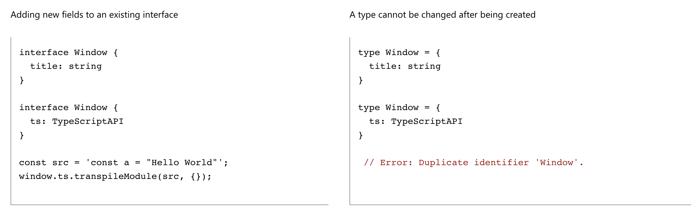

# TypeScript


# TS中数据类型

原生类型：number、boolean、undefined、null、symble、bigInt

特殊类型：any、unknow、void、never

其他：元组类型、enum、泛型、交叉类型、联合类型


### any与unknow

* any表示任何类型都行

* unknow表示未知的类型，在使用时会做类型检查

```typescript
function f1(a: any) {
  a.b(); // OK
}
function f2(a: unknown) {
  a.b();//报错，Object is of type 'unknown'.
}
```


# interface & type

* `type`与interface的作用几乎一样，但`type`能够给类型再添加一个别名。

* `type`无法重新声明追加属性。




# TS值得注意的点

1、接口可以继承接口，并且是多继承。接口不能实现接口（接口本身就是被实现的）

```typescript
interface Colorful {
  color: string;
}

interface Circle {
  radius: number;
}

interface ColorfulCircle extends Colorful, Circle {}

const cc: ColorfulCircle = {
  color: "red",
  radius: 42,
};
```

2、类的继承是必须单继承。

3、类可以直接实现类。

4、public、private、protected不能用来修饰类。可以用来修饰类的属性，方法。

5、抽象类不能被实例化

```typescript
abstract class Base {
  abstract getName(): string;

  printName() {
    console.log("Hello, " + this.getName());
  }
}

const b = new Base();//Cannot create an instance of an abstract class.
```


